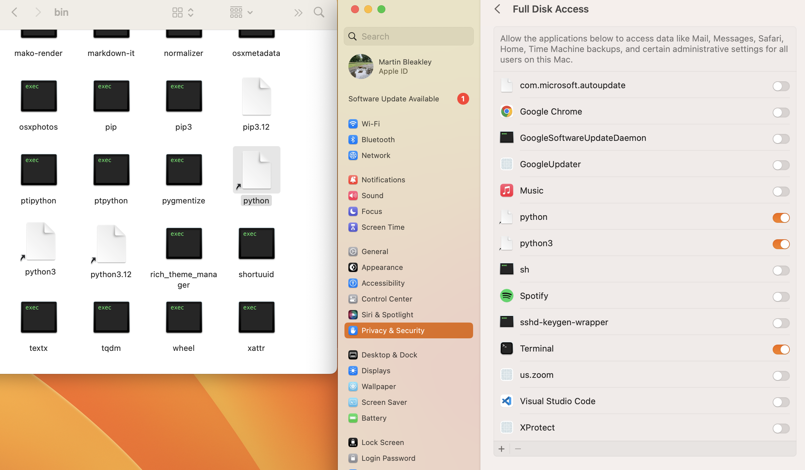
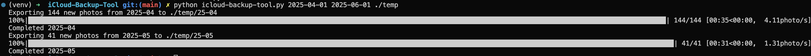

# iCloud Backup Tool

Perhaps there is an easier or more official way to do this but this worked for me. I wanted full image quality and all metadata for every picture or video I'd ever taken with an apple device to be backed up to a hard drive. To get this to run you need:

- a Mac (presumably logged into your account & w/ access to your photo library)
- python 3.12 (probably not but that's what I wrote this in)
- an external HDD/SSD and way to connect it to your Mac

## Set up a virtual environment

Optional but keeps things clean. inside this directory, run `python3.12 -m venv venv` to create the virtual environment. you should see a `venv` folder appear. run `source venv/bin/activate` to activate your environment. This will likely change your terminal prompt to include `venv`. To give your environment all the requirements it needs, run `pip install -r requirements.txt`.

## Giving python access to your full disc

You will need to give whatever version of python you are using access to your full disc.

1. Open System Settings on your Mac.
2. Go to Privacy & Security → Full Disk Access.
3. Click the “+” button to add a new app.
4. Navigate to the Python binary you're using:
   1. If you're using the system Python, it's usually located at `/usr/bin/python3`.
   2. If you're using a virtual environment, it will be inside your project folder at something like: `path/to/project/venv/bin/python3`
5. Select the Python binary and click Open.
6. Ensure the toggle next to it is turned on.

You may need to restart the Photos app and re-run the script after granting access.

### Hate when this happens

If you can't add the binary because it is greyed out, you can open finder, navigate to that same directory and drag and drop the binary file in the list. Then toggle it on.

## Running the command line tool

Assuming your hard drive is plugged in, it should appear in /Volumes. you can run `ls /Volumes` to confirm this.

from the project directory (and with the venv active if you did that), run `python icloud-backup-tool.py yyyy-mm-dd yyyy-mm-dd /Volumes/<your-drive>/<path-to-your-target-directory>`

### Example usage

This will begin copying photos and videos from that time perdiod month by month. A .csv file is also generated in the target directory which will show how many pictures/videos have been downloaded and will be used to prevent duplicate pictures if you run the program more than once.

I've only done this for my computer so it probably isn't bulletproof yet. The program will likely have to restart the photo app multiple times but it should keep trying to get all photos/videos regardless.